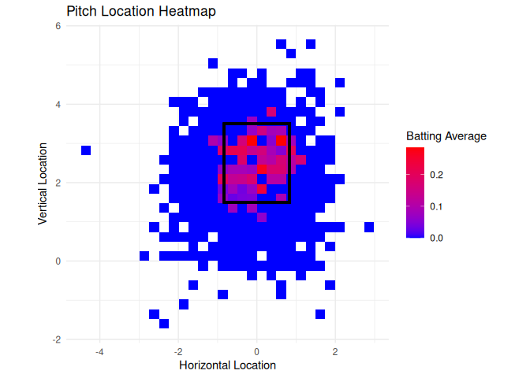
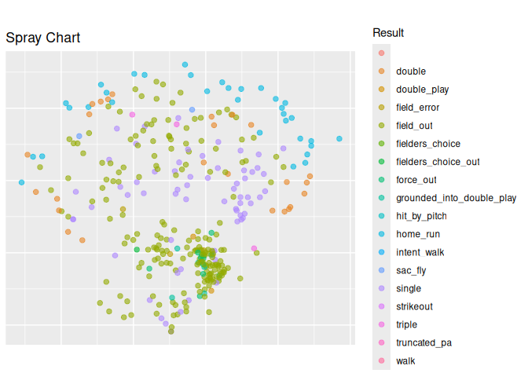

# baseballvizR

The goal of `baseballvizR` is to provide functions to easily digest
baseball statistics taken from raw statcast data.

## Installation

You can install the development version of project from
[GitHub](https://github.com/) with:

``` r

# install.packages("remotes")
# install.packages("devtools")
devtools::install_github("ADC-405-S26/baseballvizR")
```

## No Dataset

There is no dataset added to this package. Each function in this package
utilizes ‘baseballr’ functions to webscrape data every time a function
in this package is run. Because each function scrapes the data on its
own, there is no need for a dataset to run tests with.

## Example

This is a basic example which shows you how to solve a common problem:

``` r

library(baseballvizR)
```

#### plot_zone_heatmap example

``` r

plot_zone_heatmap("Juan","Soto", "2024-05-19", "2025-06-05", playerIndex = 6)
#> ── Player ID Lookup from the Chadwick Bureau's public register of baseball playe
#> ℹ Data updated: 2026-05-26 21:39:46 UTC
#> # A tibble: 6 × 11
#>   first_name last_name given_name   name_suffix nick_name birth_year
#>   <chr>      <chr>     <chr>        <chr>       <chr>          <int>
#> 1 Juan       DeSoto    Juan Enrique ""          ""              1962
#> 2 Juan       Soto      Juan H.      ""          ""              1990
#> 3 Juan       Soto      Juan Ruddy   ""          ""              2003
#> 4 Juan       Soto      Juan A.      ""          ""              1972
#> 5 Juan       DeSoto    Juan         ""          ""                NA
#> 6 Juan       Soto      Juan Jose    ""          ""              1998
#> # ℹ 5 more variables: mlb_played_first <int>, mlbam_id <int>,
#> #   retrosheet_id <chr>, bbref_id <chr>, fangraphs_id <int>
#> Warning: Removed 28 rows containing non-finite outside the scale range
#> (`stat_summary2d()`).
```



#### plot_spray_chart example

``` r

plot_spray_chart("Juan","Soto", "2024-05-19", "2025-06-05", playerIndex = 6)
#> ── Player ID Lookup from the Chadwick Bureau's public register of baseball playe
#> ℹ Data updated: 2026-05-26 21:39:53 UTC
#> # A tibble: 6 × 11
#>   first_name last_name given_name   name_suffix nick_name birth_year
#>   <chr>      <chr>     <chr>        <chr>       <chr>          <int>
#> 1 Juan       DeSoto    Juan Enrique ""          ""              1962
#> 2 Juan       Soto      Juan H.      ""          ""              1990
#> 3 Juan       Soto      Juan Ruddy   ""          ""              2003
#> 4 Juan       Soto      Juan A.      ""          ""              1972
#> 5 Juan       DeSoto    Juan         ""          ""                NA
#> 6 Juan       Soto      Juan Jose    ""          ""              1998
#> # ℹ 5 more variables: mlb_played_first <int>, mlbam_id <int>,
#> #   retrosheet_id <chr>, bbref_id <chr>, fangraphs_id <int>
#> Warning: Removed 2035 rows containing missing values or values outside the scale range
#> (`geom_point()`).
```



#### calculate_hitter_profile example

``` r

calculate_hitter_profile("Juan","Soto", "2024-05-19", "2025-06-05", playerIndex = 6)
#> ── Player ID Lookup from the Chadwick Bureau's public register of baseball playe
#> ℹ Data updated: 2026-05-26 21:40:00 UTC
#> # A tibble: 6 × 11
#>   first_name last_name given_name   name_suffix nick_name birth_year
#>   <chr>      <chr>     <chr>        <chr>       <chr>          <int>
#> 1 Juan       DeSoto    Juan Enrique ""          ""              1962
#> 2 Juan       Soto      Juan H.      ""          ""              1990
#> 3 Juan       Soto      Juan Ruddy   ""          ""              2003
#> 4 Juan       Soto      Juan A.      ""          ""              1972
#> 5 Juan       DeSoto    Juan         ""          ""                NA
#> 6 Juan       Soto      Juan Jose    ""          ""              1998
#> # ℹ 5 more variables: mlb_played_first <int>, mlbam_id <int>,
#> #   retrosheet_id <chr>, bbref_id <chr>, fangraphs_id <int>
#> # A tibble: 1 × 11
#>    Hits   HRs Walks IntentionalWalk HitByPitch StrikeOut FieldOut DoublePlay
#>   <dbl> <dbl> <dbl>           <dbl>      <dbl>     <dbl>    <dbl>      <dbl>
#> 1   125    34   108               4          3        98      198          6
#> # ℹ 3 more variables: ForceOut <dbl>, SacFly <dbl>, FielderError <dbl>
```
